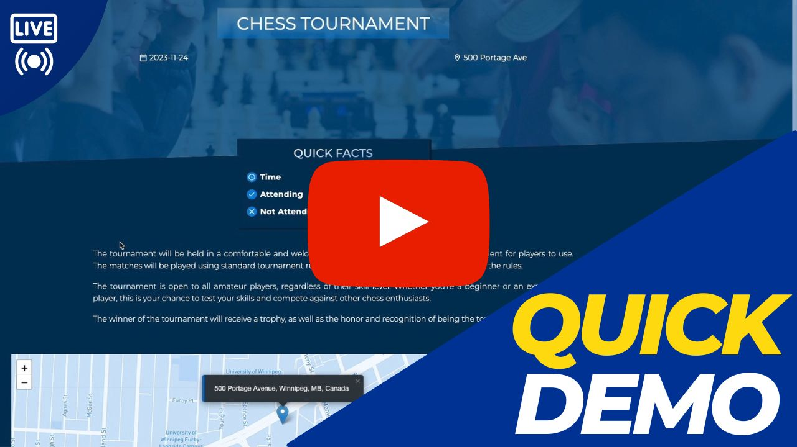
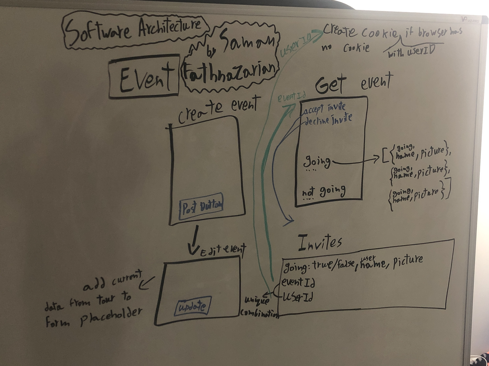

# Event Booking Web Application

## Application Architecture

An event booking web application, similar to Facebook events, allows you to easily create, share and manage events. With a customizable map, responsive design, and attendee responses, you can effortlessly plan and execute successful events.

## Features

- A form for creating an event, including fields for event name, date and time, location, description, and a photo or image related to the event.
- A feature to generate a unique link for each event, which the event organizer can share with their friends or social media followers to invite them to the event.
- An RSVP system that allows users who have received an invitation to an event to respond as to whether they will attend or not.
- A map feature that shows the location of the event, using Mapbox, and allows attendees to get directions or see nearby points of interest.
- A responsive design that adapts to different screen sizes and devices, ensuring a seamless user experience across desktop and mobile platforms.

### Author

Saman Fathnazarian - <a href="https://imsaman.com" target="_blank">https://imsaman.com</a>
